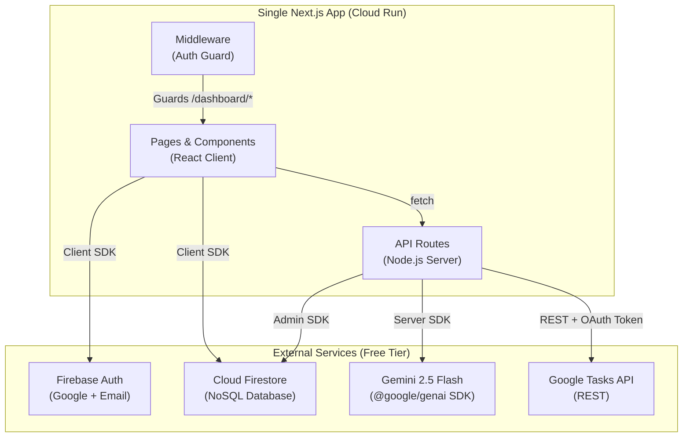
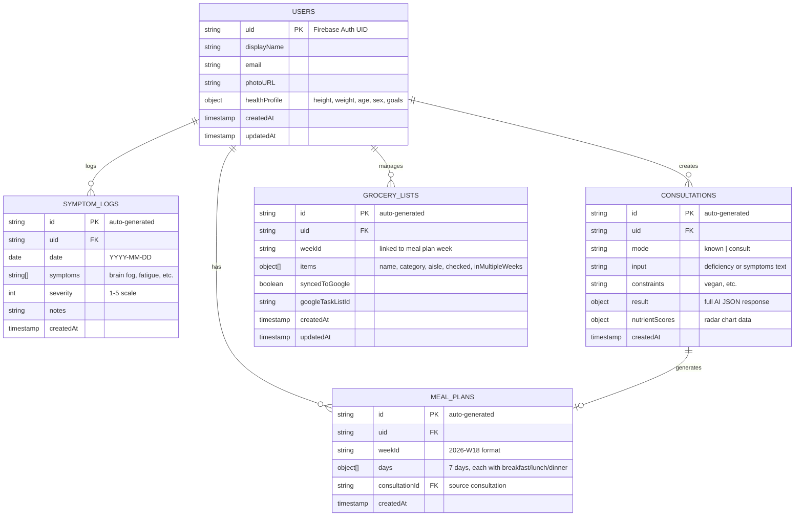

# NutriSync v2 — Complete Rebuild Implementation Plan

A ground-up rebuild of the NutriSync clinical nutrition assistant. The old codebase (split Python backend + Next.js frontend, hardcoded Cloud Run URLs, Cloud SQL dependency) is fully scrapped. This plan delivers a **single Next.js monolith** with Firebase for auth/database, Gemini for AI, and Google Tasks for grocery sync — all deployable via **one Dockerfile** to Cloud Run.

---

## User Review Required

> [!IMPORTANT]
> **Firebase Project**: You need to create a new Firebase project (or reuse an existing one) at [console.firebase.google.com](https://console.firebase.google.com). Enable **Authentication** (Google + Email/Password providers) and **Cloud Firestore** (start in test mode for hackathon speed). This is free tier.

> [!IMPORTANT]
> **Gemini API Key**: Get a free API key from [aistudio.google.com](https://aistudio.google.com). No GCP billing required — the free tier gives 15 RPM for Gemini 2.5 Flash, which is enough for the hackathon.

> [!IMPORTANT]
> **Google Tasks API**: You need to enable the Google Tasks API in the same GCP project linked to your Firebase project, and create an OAuth 2.0 Web Client credential. The redirect URI will be `http://localhost:3000/api/auth/callback/google` for local dev and your Cloud Run URL for production.

## Open Questions

> [!WARNING]
> **Design System**: Your wireframes show a warm cream/crimson/peach palette from the old project. Should I keep that exact color scheme, or do you want a fresh look? I'll default to keeping the established brand unless you say otherwise.

> [!WARNING]
> **Hackathon Timeline**: How many days do you have? This plan is ordered by priority so we can cut scope cleanly if needed. The MVP (Phases 1–3) is a solid submission on its own.

---

## Architecture Overview



### Key Architectural Decision: No Python Backend

The old project used FastAPI solely to call Vertex AI (Gemini). The `@google/genai` Node.js SDK provides identical functionality. This eliminates the entire Python layer, giving us:
- **Single Dockerfile** — just Next.js
- **No CORS issues** — API routes are same-origin
- **Simpler deployment** — one Cloud Run service
- **Simpler env management** — one `.env.local` file

---

## Firestore Data Model



All collections are scoped under `users/{uid}/...` for Firestore security rules.

---

## Project Structure

```
nutrisync/
├── app/
│   ├── layout.tsx                    # Root layout (fonts, providers)
│   ├── page.tsx                      # Landing/Home page
│   ├── globals.css                   # Design system tokens + global styles
│   │
│   ├── (auth)/                       # Auth route group (no layout nesting)
│   │   ├── login/page.tsx            # Login page (Google + Email)
│   │   └── register/page.tsx         # Register page
│   │
│   ├── dashboard/                    # Protected route group
│   │   ├── layout.tsx                # Dashboard shell (sidebar + topbar)
│   │   ├── page.tsx                  # Dashboard overview (today's plan, calendar, health)
│   │   ├── consult/page.tsx          # AI consultation (known gap + symptom modes)
│   │   ├── meal-planner/page.tsx     # Weekly meal planner
│   │   ├── grocery-list/page.tsx     # Grocery list with tick-off + Google Tasks sync
│   │   ├── symptoms/page.tsx         # Symptom timeline tracker
│   │   └── profile/page.tsx          # Health profile + settings
│   │
│   └── api/                          # Server-side API routes
│       ├── consult/route.ts          # AI consultation endpoint
│       ├── explain/route.ts          # "Why these foods?" explainer
│       ├── meal-plan/route.ts        # Generate weekly meal plan
│       ├── tasks/route.ts            # Google Tasks sync
│       └── grocery/route.ts          # Smart grocery bundling logic
│
├── components/
│   ├── ui/                           # Generic reusable UI components
│   │   ├── Button.tsx
│   │   ├── Card.tsx
│   │   ├── Input.tsx
│   │   ├── Modal.tsx
│   │   ├── Badge.tsx
│   │   └── Loader.tsx
│   │
│   ├── layout/                       # Layout components
│   │   ├── Navbar.tsx                # Landing page navbar
│   │   ├── Sidebar.tsx               # Dashboard sidebar navigation
│   │   ├── Topbar.tsx                # Dashboard top bar (user avatar, notifications)
│   │   └── Footer.tsx                # Landing page footer
│   │
│   ├── dashboard/                    # Dashboard-specific components
│   │   ├── TodayMealCard.tsx         # Today's meal plan widget
│   │   ├── CalendarWidget.tsx        # Monthly calendar with completion tracking
│   │   ├── HealthPreview.tsx         # Body stats card (BMI, weight, goals)
│   │   ├── NutrientRadarChart.tsx    # Radar/spider chart of 8 key nutrients
│   │   ├── SymptomTrendChart.tsx     # 7-day symptom line chart
│   │   └── QuickActions.tsx          # Action buttons (new consult, log symptoms)
│   │
│   ├── consult/                      # Consultation components
│   │   ├── ConsultPanel.tsx          # Main consultation UI (modes, inputs)
│   │   ├── ResultCard.tsx            # Displays AI results (foods, plan, dos/donts)
│   │   └── ExplainButton.tsx         # "Why these foods?" trigger
│   │
│   ├── grocery/                      # Grocery list components
│   │   ├── GroceryItem.tsx           # Single item with checkbox + aisle badge
│   │   ├── AisleGroup.tsx            # Group items by store aisle
│   │   └── BulkBuyBadge.tsx          # Flag for items appearing in multiple weeks
│   │
│   └── charts/                       # Chart wrapper components
│       ├── RadarChart.tsx            # chart.js radar chart wrapper
│       └── LineChart.tsx             # chart.js line chart wrapper
│
├── lib/                              # Shared utilities and configurations
│   ├── firebase.ts                   # Firebase client SDK init (auth + firestore)
│   ├── firebase-admin.ts             # Firebase Admin SDK init (for API routes)
│   ├── gemini.ts                     # Gemini AI client init + helpers
│   ├── prompts.ts                    # All AI prompt templates (centralized)
│   ├── constants.ts                  # App-wide constants (nutrients list, aisle map)
│   └── utils.ts                      # General utilities (date formatting, etc.)
│
├── hooks/                            # Custom React hooks
│   ├── useAuth.ts                    # Auth state hook (wraps Firebase onAuthStateChanged)
│   ├── useFirestore.ts               # Generic Firestore CRUD hook
│   └── useConsultation.ts            # Consultation flow state management
│
├── context/                          # React Context providers
│   └── AuthContext.tsx               # Auth provider wrapping the app
│
├── types/                            # TypeScript type definitions
│   └── index.ts                      # All interfaces (User, Consultation, MealPlan, etc.)
│
├── public/                           # Static assets
│   └── logo.svg
│
├── middleware.ts                     # Next.js middleware (auth route guards)
├── next.config.ts                    # Next.js config (standalone output)
├── package.json
├── tsconfig.json
├── Dockerfile                        # Single multi-stage Dockerfile for Cloud Run
├── .dockerignore
├── .env.local.example                # Template for environment variables
├── CHANGELOG.md                      # Tracks all changes for hackathon code review
└── README.md                         # Setup + architecture docs
```

---

## Proposed Changes (Ordered by Build Phase)

### Phase 1: Foundation & Auth
> Estimated time: ~2 hours

#### [NEW] `package.json`
Initialize Next.js 16 project with all dependencies:
- `next`, `react`, `react-dom` (core)
- `firebase` (client SDK for auth + Firestore)
- `firebase-admin` (server SDK for API routes)
- `@google/genai` (Gemini AI)
- `chart.js`, `react-chartjs-2` (charts)
- `@tailwindcss/postcss`, `tailwindcss` (styling)

#### [NEW] `next.config.ts`
```typescript
output: 'standalone'  // Critical for Cloud Run single-Dockerfile deployment
```

#### [NEW] `lib/firebase.ts`
Client-side Firebase initialization. Singleton pattern to prevent re-initialization.

#### [NEW] `lib/firebase-admin.ts`
Server-side Firebase Admin SDK for API routes. Uses `FIREBASE_SERVICE_ACCOUNT` env var (JSON string).

#### [NEW] `context/AuthContext.tsx`
React context provider that:
- Listens to `onAuthStateChanged`
- Stores user + loading state
- Provides `signInWithGoogle()`, `signInWithEmail()`, `signUp()`, `signOut()` methods

#### [NEW] `middleware.ts`
Next.js middleware that redirects unauthenticated users from `/dashboard/*` to `/login`. Uses a session cookie set on login.

#### [NEW] `app/(auth)/login/page.tsx` and `register/page.tsx`
Clean login/register pages with Google button + email/password form.

#### [NEW] `types/index.ts`
All TypeScript interfaces: `User`, `HealthProfile`, `Consultation`, `MealPlan`, `GroceryList`, `GroceryItem`, `SymptomLog`, `NutrientScore`.

---

### Phase 2: Landing Page & Design System
> Estimated time: ~2 hours

#### [NEW] `app/globals.css`
Full design system with CSS custom properties:
- Color palette (cream, crimson, rose, peach, soft-pink)
- Typography scale (Google Fonts: Inter for body, Playfair Display for headings)
- Spacing, border-radius, shadows
- Component-level classes
- Animations (fade-in, slide-up, pulse)

#### [NEW] `app/page.tsx`
Landing page matching your wireframe:
- **Navbar**: Logo + "Sign In" / "Welcome back, $user" conditional
- **Hero**: Large headline + subtitle + CTA button
- **Features Section**: 3–4 cards showing core capabilities
- **Dashboard Preview**: Screenshot/mockup of the dashboard
- **Footer**: Links + branding

#### [NEW] `components/layout/Navbar.tsx`, `Footer.tsx`
Reusable layout components for the landing page.

#### [NEW] `components/ui/*`
Base UI components (Button, Card, Input, Modal, Badge, Loader) all using the design system tokens. Every component will have:
- JSDoc comments explaining props
- Unique `id` attributes for testing
- Consistent hover/focus states

---

### Phase 3: Dashboard & AI Consultation (MVP Core)
> Estimated time: ~4 hours

#### [NEW] `app/dashboard/layout.tsx`
Dashboard shell with:
- **Sidebar**: Navigation links (Overview, Consult, Meal Planner, Grocery List, Symptoms, Profile)
- **Topbar**: User avatar, greeting, quick actions
- Responsive: sidebar collapses to hamburger on mobile

#### [NEW] `app/dashboard/page.tsx`
Dashboard overview matching your wireframe:
- **Today's Meal Card**: Shows today's planned meals from active meal plan
- **Calendar Widget**: Monthly view with dots on days with completed meals
- **Health Preview**: User's body stats (height, weight, BMI, goal)
- **Quick Actions**: "New Consultation", "Log Symptoms" buttons

#### [NEW] `lib/gemini.ts`
Gemini client initialization:
```typescript
import { GoogleGenAI } from '@google/genai';
export const ai = new GoogleGenAI({ apiKey: process.env.GEMINI_API_KEY! });
```

#### [NEW] `lib/prompts.ts`
**Centralized prompt templates** — this is critical for hackathon code review. Every prompt is:
- Named and exported as a function
- Documented with JSDoc
- Returns a string (no logic, just template)

Templates for:
- `buildKnownGapPrompt(deficiency, constraints)` — known deficiency analysis
- `buildSymptomConsultPrompt(symptoms, constraints)` — symptom-based diagnosis
- `buildExplainPrompt(deficiency, foods)` — food explanation
- `buildMealPlanPrompt(deficiency, foods, constraints, days)` — weekly meal plan generation

All prompts enforce strict JSON output schema.

#### [NEW] `app/api/consult/route.ts`
Server-side API route:
1. Receives `{ mode, deficiency?, symptoms?, constraints }`
2. Selects the right prompt template
3. Calls Gemini via `@google/genai`
4. Parses and validates JSON response (with retry on parse failure)
5. Stores result in Firestore under `users/{uid}/consultations`
6. Returns parsed result

#### [NEW] `app/api/explain/route.ts`
Server-side "Why these foods?" endpoint.

#### [NEW] `app/dashboard/consult/page.tsx` + `components/consult/*`
Full consultation UI:
- Mode toggle (Known Gap / Consult Symptoms)
- Input fields (deficiency text / symptoms textarea + constraints)
- "Analyze" button
- Result display: foods list, severity badge, meal plan, dos/don'ts, buy list
- "Explain Why" button
- "Add to Grocery List" button

---

### Phase 4: Meal Planner & Grocery List
> Estimated time: ~3 hours

#### [NEW] `app/api/meal-plan/route.ts`
Generates a 7-day meal plan from a consultation result using Gemini. Stores in Firestore under `users/{uid}/mealPlans`.

#### [NEW] `app/dashboard/meal-planner/page.tsx`
Weekly meal planner view:
- Week selector (current week, next week)
- 7 columns (or swipeable cards on mobile), each with Breakfast/Lunch/Dinner
- Nutritional value badges per meal
- "Generate Plan" button triggers AI
- Each meal shows food items + calories + key nutrients

#### [NEW] `app/api/grocery/route.ts`
Smart grocery bundling logic:
1. Takes all items from a meal plan
2. Deduplicates across days
3. Categorizes by store aisle (Produce, Dairy, Proteins, Grains, Spices, Other)
4. Flags items appearing in multiple weeks' plans with a "Buy in Bulk" badge
5. Returns structured list

#### [NEW] `app/dashboard/grocery-list/page.tsx` + `components/grocery/*`
Interactive grocery list:
- Grouped by aisle category with collapsible sections
- Checkbox per item (tick-off syncs to Firestore in real-time)
- "Bulk Buy" badge on recurring items
- "Sync to Google Tasks" button

#### [NEW] `app/api/tasks/route.ts`
Google Tasks sync:
1. Creates a "NutriSync — Week XX" task list
2. Adds category headers as parent tasks
3. Adds individual items as sub-tasks
4. Updates Firestore grocery list with `syncedToGoogle: true` and `googleTaskListId`

---

### Phase 5: Symptom Tracker & Nutrient Scorecard
> Estimated time: ~2 hours

#### [NEW] `app/dashboard/symptoms/page.tsx`
Symptom timeline:
- Daily log form: select symptoms from predefined list + severity slider (1–5) + notes
- 7-day trend line chart showing severity over time
- AI-generated insight: "Brain fog improving since you added B12 foods" (uses Gemini)

#### [NEW] `components/charts/RadarChart.tsx`
Nutrient radar chart using `react-chartjs-2`:
- 8 axes: Iron, B12, Vitamin D, Magnesium, Calcium, Zinc, Folate, Omega-3
- Color-coded zones: Red (deficient) → Yellow (borderline) → Green (healthy)
- Overlays current score vs. target

#### [NEW] `components/charts/LineChart.tsx`
Symptom trend line chart using `react-chartjs-2`.

#### [NEW] `components/dashboard/NutrientRadarChart.tsx`
Dashboard widget wrapping the radar chart with latest consultation scores.

#### [NEW] `components/dashboard/SymptomTrendChart.tsx`
Dashboard widget wrapping the line chart with last 7 days of symptom data.

---

### Phase 6: Health Profile & Polish
> Estimated time: ~1.5 hours

#### [NEW] `app/dashboard/profile/page.tsx`
User health profile page:
- Edit: height, weight, age, sex, dietary goals
- Calculated BMI display
- Save to Firestore `users/{uid}` doc

#### [NEW] `components/dashboard/HealthPreview.tsx`
Dashboard card showing a visual body stats summary.

---

### Phase 7: Deployment & Documentation
> Estimated time: ~1 hour

#### [NEW] `Dockerfile`
Multi-stage build:
```dockerfile
# Stage 1: deps
FROM node:20-alpine AS deps
WORKDIR /app
COPY package*.json ./
RUN npm ci

# Stage 2: build
FROM node:20-alpine AS builder
WORKDIR /app
COPY --from=deps /app/node_modules ./node_modules
COPY . .
ENV NEXT_TELEMETRY_DISABLED=1
RUN npm run build

# Stage 3: runner
FROM node:20-alpine AS runner
WORKDIR /app
ENV NODE_ENV=production
RUN addgroup --system --gid 1001 nodejs
RUN adduser --system --uid 1001 nextjs
COPY --from=builder /app/public ./public
COPY --from=builder --chown=nextjs:nodejs /app/.next/standalone ./
COPY --from=builder --chown=nextjs:nodejs /app/.next/static ./.next/static
USER nextjs
EXPOSE 8080
ENV PORT=8080
ENV HOSTNAME="0.0.0.0"
CMD ["node", "server.js"]
```

#### [NEW] `.env.local.example`
```env
# Firebase Client (public — safe for browser)
NEXT_PUBLIC_FIREBASE_API_KEY=
NEXT_PUBLIC_FIREBASE_AUTH_DOMAIN=
NEXT_PUBLIC_FIREBASE_PROJECT_ID=
NEXT_PUBLIC_FIREBASE_STORAGE_BUCKET=
NEXT_PUBLIC_FIREBASE_MESSAGING_SENDER_ID=
NEXT_PUBLIC_FIREBASE_APP_ID=

# Firebase Admin (server-only — NEVER expose)
FIREBASE_SERVICE_ACCOUNT={"type":"service_account",...}

# Gemini AI (server-only)
GEMINI_API_KEY=

# Google OAuth (for Google Tasks integration)
GOOGLE_CLIENT_ID=
GOOGLE_CLIENT_SECRET=
NEXTAUTH_SECRET=
NEXTAUTH_URL=http://localhost:3000
```

#### [NEW] `CHANGELOG.md`
Living document updated after every phase:
```markdown
# Changelog — NutriSync v2

## [Phase 1] — Foundation & Auth
- Initialized Next.js 16 project with standalone output
- Configured Firebase Auth (Google + Email/Password)
- Set up Firestore database with security rules
- Created AuthContext provider and middleware route guards
...
```

#### [NEW] `README.md`
Full project documentation:
- Architecture diagram
- Setup instructions (local dev + Cloud Run deployment)
- Environment variable reference
- API route documentation
- Design decisions log

---

## Verification Plan

### Automated Tests (During Development)
1. **Build check**: `npm run build` succeeds with zero errors after each phase
2. **Type check**: `npx tsc --noEmit` passes
3. **Lint**: `npx next lint` passes
4. **Docker build**: `docker build -t nutrisync .` succeeds
5. **API route testing**: Use browser dev tools / curl to verify each API route returns expected JSON

### Manual Verification
1. **Auth flow**: Login with Google → redirect to dashboard → logout → redirect to login
2. **Consultation flow**: Enter deficiency → get AI response → see results rendered
3. **Meal planner**: Generate weekly plan → view daily meals → navigate between weeks
4. **Grocery list**: View grouped items → tick off items → verify Firestore updates → sync to Google Tasks
5. **Symptom tracker**: Log symptoms → view 7-day trend → see AI insight
6. **Radar chart**: After consultation, verify nutrient scores render correctly
7. **Cloud Run**: Deploy via `gcloud run deploy --source .` → verify all features work on production URL

### Hackathon Code Review Readiness
- Every file has JSDoc/comments explaining its purpose
- `CHANGELOG.md` logs every change with rationale
- `README.md` covers architecture + setup + decisions
- Clean git history with descriptive commit messages
- No hardcoded values — all config via environment variables
- No dead code or TODO comments left behind
